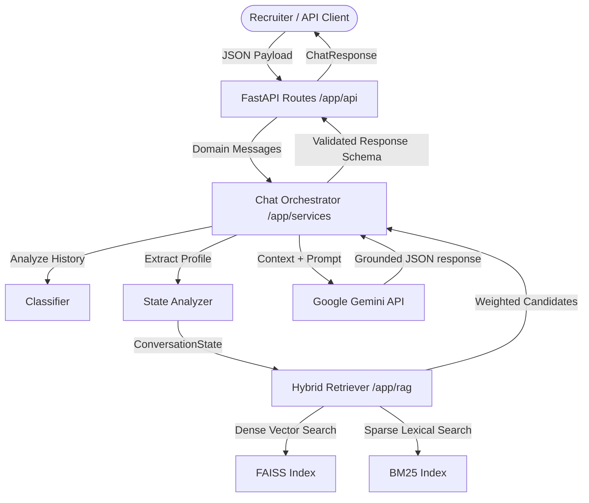

# SHL Conversational Assessment Recommendation portal

An enterprise-ready, production-grade conversational agent that helps recruiters discover relevant SHL assessments from the **SHL Individual Test Solutions** catalog through natural dialog. Built with FastAPI, FAISS, Sentence Transformers, and Google Gemini.

---

## 1. System Architecture

The application is structured using **Clean Architecture** patterns, ensuring the domain layer is completely decoupled from external frameworks, LLM providers, and data layers.



### Module Boundaries:
*   **Domain Models (`app/models/domain.py`)**: Defines core objects (`Assessment`, `ConversationState`, `Message`) independent of external dependencies.
*   **Use Cases (`app/services/`)**: Implements conversation orchestration, classification, and criteria state extraction.
*   **Adapters (`app/rag/`, `app/api/`)**: Houses concrete database index drivers (FAISS, BM25) and route controllers.

---

## 2. Technical Stack
*   **Language**: Python 3.12+
*   **API Framework**: FastAPI, Uvicorn
*   **Vector Search & Embeddings**: FAISS, SentenceTransformers (`all-MiniLM-L6-v2`)
*   **Lexical Search**: Rank-BM25
*   **LLM Integration**: Google Gemini API (`google-generativeai`)
*   **Containerization**: Docker, Docker Compose

---

## 3. Directory Layout

```
shl_recommender/
│
├── app/
│   ├── api/                       # API layer (exceptions, routes)
│   ├── config/                    # Configurations (BaseSettings)
│   ├── models/                    # Domain Schemas & API Request/Response Models
│   ├── prompts/                   # Externalized prompt templates (.txt)
│   ├── rag/                       # FAISS + BM25 hybrid search logic
│   ├── services/                  # LLM orchestration, classification & analyzer
│   └── main.py                    # App factory & entrypoint
│
├── data/
│   ├── processed/                 # Cleaned catalog.json
│   └── index/                     # Compiled FAISS and BM25 index binaries
│
├── docs/
│   └── deployment.md              # Railway/Render cloud instructions
│
├── scripts/
│   ├── scrape.py                  # Ingestion & crawlers
│   └── build_index.py             # Embeddings indexing script
│
├── tests/                         # Full Pytest suite
│   ├── conftest.py
│   └── test_chat.py
│
├── Dockerfile
├── docker-compose.yml
├── requirements.txt
└── README.md
```

---

## 4. Local Setup Guide

### Step 1: Create Virtual Environment & Install Packages
```bash
python -m venv .venv
# On Windows
.venv\Scripts\activate
# On Unix/macOS
source .venv/bin/activate

pip install -r requirements.txt
```

### Step 2: Set Environment Variables
Create a `.env` file in the root directory:
```env
GOOGLE_API_KEY=your_gemini_api_key_here
MODEL_NAME=gemini-1.5-flash
TOP_K=5
TEMPERATURE=0.0
EMBEDDING_MODEL=all-MiniLM-L6-v2
```

### Step 3: Run Crawler & Precompile Search Indices
```bash
# 1. Ingest/Scrape the SHL Catalog
python scripts/scrape.py

# 2. Build the FAISS dense vectors
python scripts/build_index.py
```

### Step 4: Launch Web Server
```bash
uvicorn app.main:app --host 0.0.0.0 --port 8000 --reload
```
API endpoints will be active at:
*   Health Check: [http://localhost:8000/health](http://localhost:8000/health)
*   Swagger UI Docs: [http://localhost:8000/docs](http://localhost:8000/docs)

---

## 5. API Documentation

### 5.1 Health Check Endpoint
*   **Path**: `GET /health`
*   **Response (JSON)**:
    ```json
    {
      "status": "ok"
    }
    ```

### 5.2 Chat Interaction Endpoint
*   **Path**: `POST /chat`
*   **Request Schema (JSON)**:
    ```json
    {
      "messages": [
        {"role": "user", "content": "I want to hire a Java Developer."},
        {"role": "assistant", "content": "Sure! Are you looking for coding tests or personality questionnaires?"},
        {"role": "user", "content": "Just coding simulations."}
      ]
    }
    ```
*   **Response Schema (JSON)**:
    ```json
    {
      "reply": "I recommend the Java Software Engineer Simulation which tests practical algorithms and OOP concepts.",
      "recommendations": [
        {
          "name": "Java Software Engineer Simulation",
          "url": "https://www.shl.com/solutions/products/product-catalog/view/java-software-engineer-simulation/",
          "test_type": "S, K"
        }
      ],
      "end_of_conversation": false
    }
    ```

---

## 6. Verification and Testing

Execute the automated test suite covering all intent paths, injection, and off-topic refusals:
```bash
pytest tests/
```
All 9 core tests run with offline mock fixtures, returning `9 passed` results.

---

## 7. Containerization (Docker)

To run the containerized application locally using Compose:
```bash
docker-compose up --build
```
This builds a hardened image running under a non-root system user. It compiles the FAISS database during image construction to guarantee instantaneous boot performance.
"# AssessIQ" 
